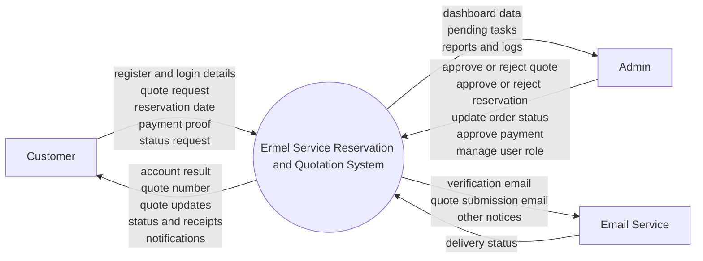
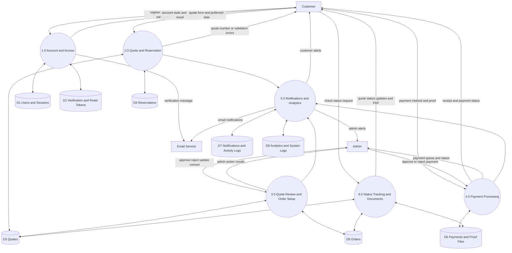
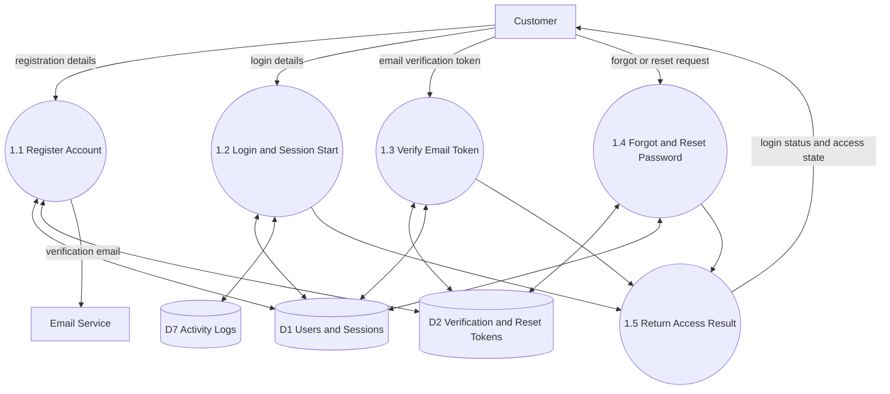
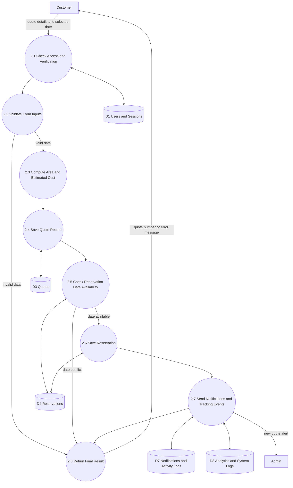
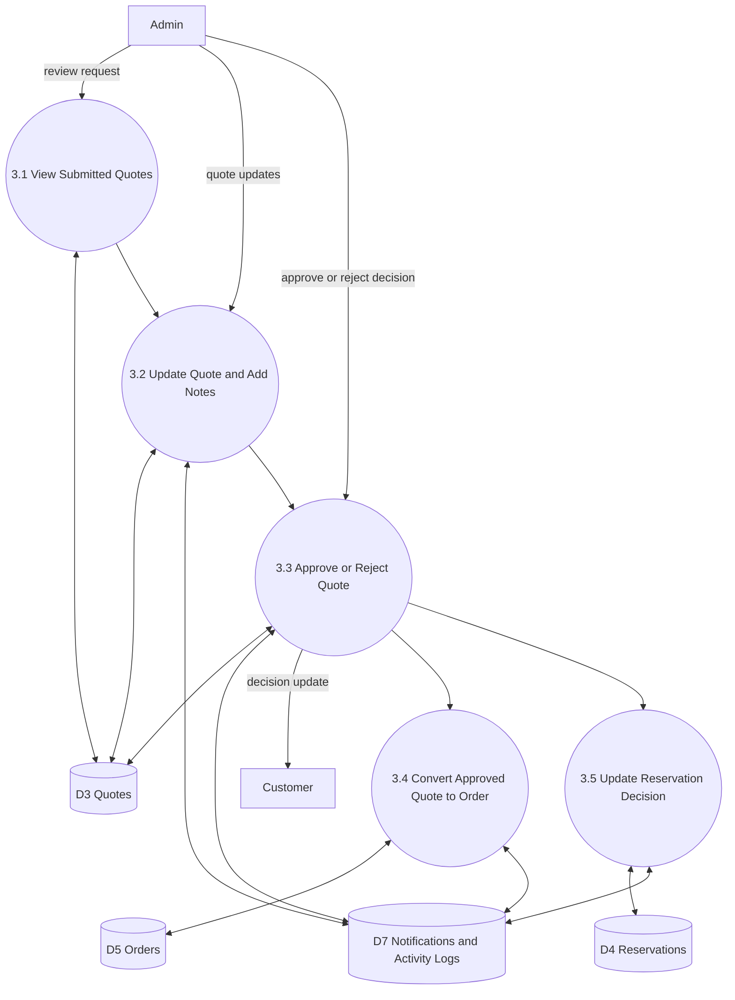
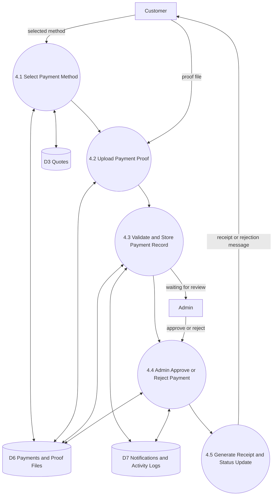
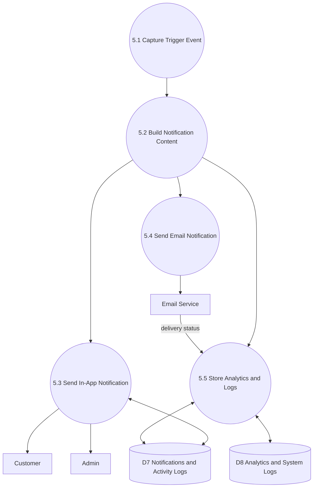
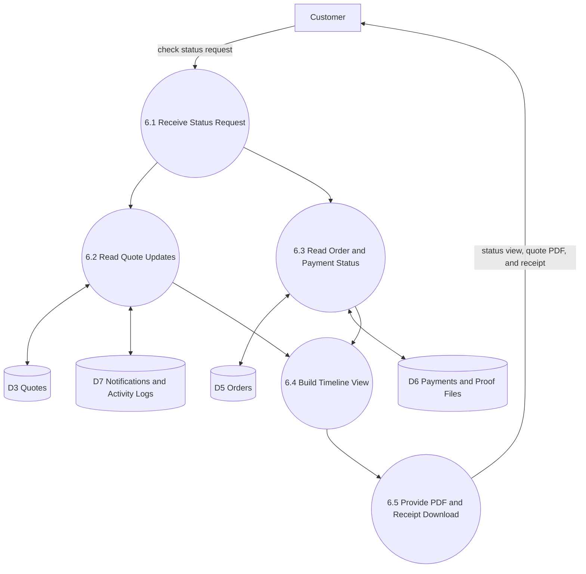

# Ermel System Data Flow Diagram (DFD)

This document is written in simple language for capstone presentation.

## 1) Context Level Diagram (Level 0)

## 2) Logical Level Diagram (Level 1)

## 3) Logical Child Diagrams (Level 2)

This section expands all major Level 1 processes.

### 3.1 Child Diagram for 1.0 Account and Access

### 3.2 Child Diagram for 2.0 Quote and Reservation

### 3.3 Child Diagram for 3.0 Quote Review and Order Setup

### 3.4 Child Diagram for 4.0 Payment Processing

### 3.5 Child Diagram for 5.0 Notifications and Analytics

### 3.6 Child Diagram for 6.0 Status Tracking and Documents

## 4) Quick Presentation Checklist

- External entities: Customer, Admin, Email Service
- Core processes: Account, Quote and Reservation, Admin Review, Payment, Notifications and Analytics, Status Tracking
- Main data stores: users, tokens, quotes, reservations, orders, payments, notifications and logs, analytics logs
- Major outputs: quote number, reservation result, payment status, PDF, dashboard metrics
- Security controls shown in flows: session check, verified-email check, CSRF check, rate limit, input validation

## 5) Notes and Scope Decisions Used

- The child diagrams cover all major Level 1 processes so your panel can trace each part clearly.
- Payment is shown as customer proof upload and admin approval or rejection.
- Notifications and analytics are grouped in one process to keep the Level 1 view readable.