# DFD Level 0

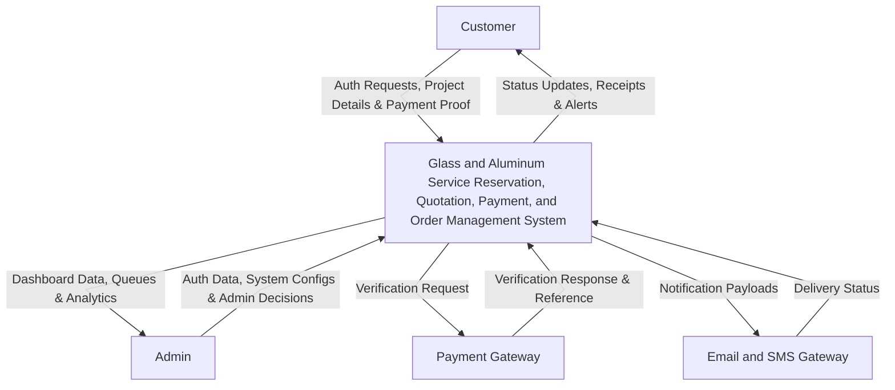

# DFD Level 1 (Process View)

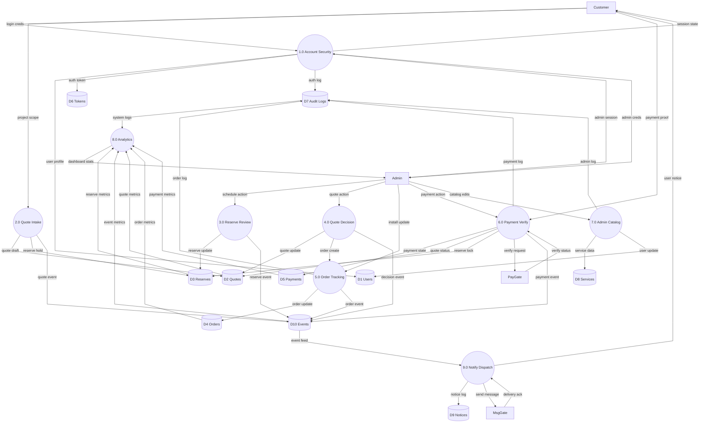

# DFD Level 2A (Child Diagram for 1.0 Account Security)

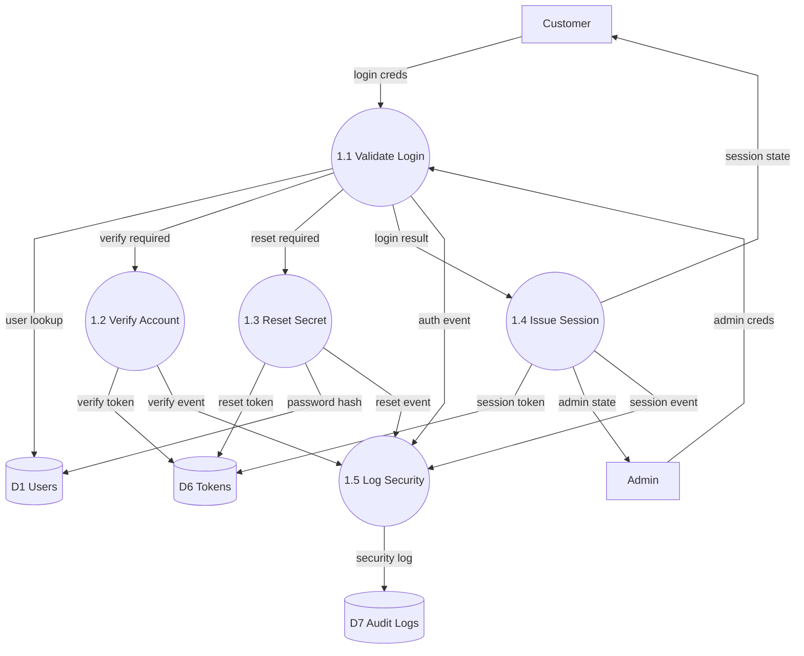

# DFD Level 2B: Child Diagram for 2.0 Quote Intake

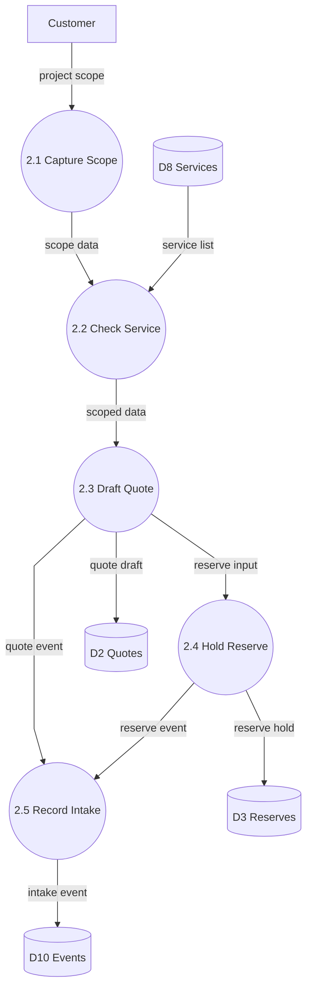

# DFD Level 2C: Child Diagram for 3.0 Reserve Review

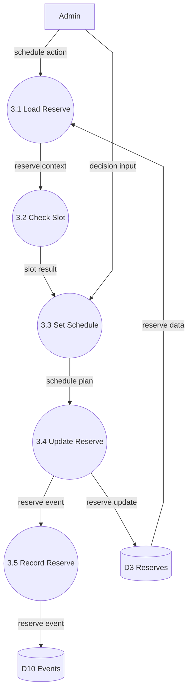

# DFD Level 2D: Child Diagram for 4.0 Quote Decision

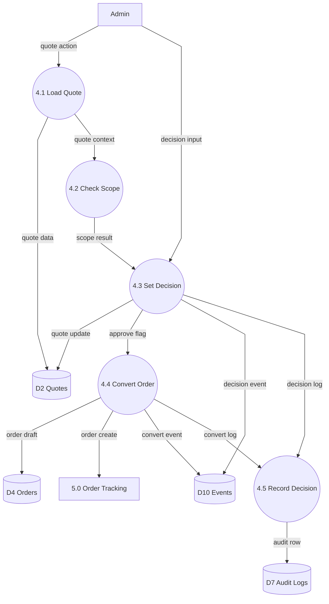

# DFD Level 2E: Child Diagram for 5.0 Order Tracking

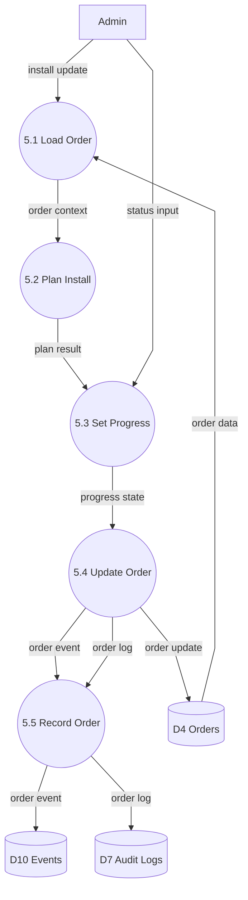

# DFD Level 2F: Child Diagram for 6.0 Payment Verify

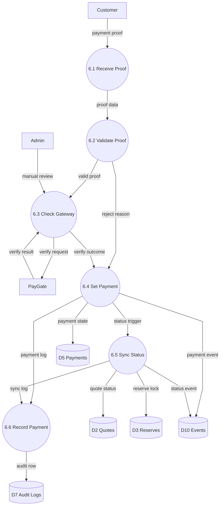

# DFD Level 2G: Child Diagram for 7.0 Admin Catalog

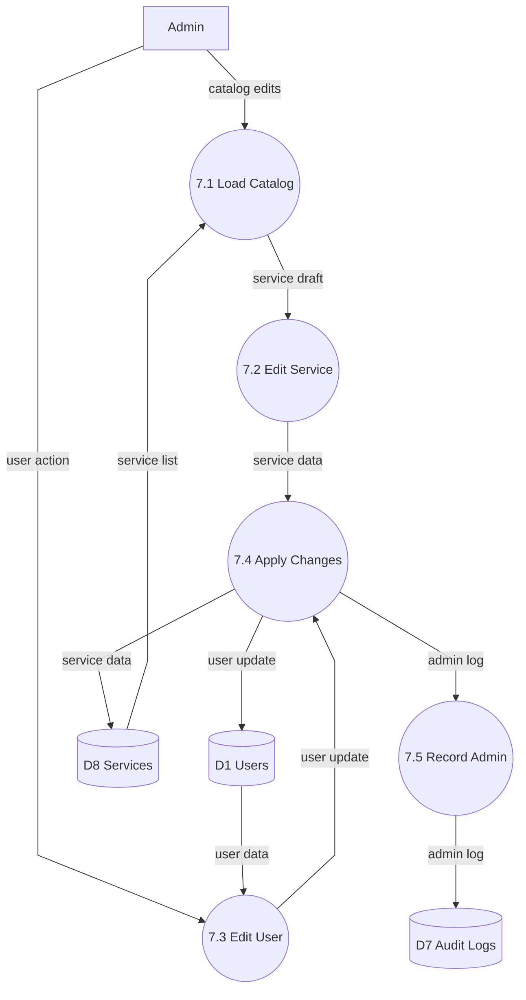

# DFD Level 2H: Child Diagram for 8.0 Analytics

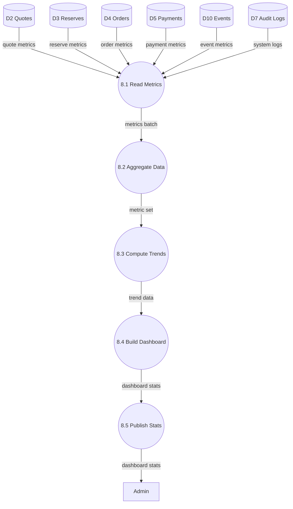

# DFD Level 2I: Child Diagram for 9.0 Notify Dispatch

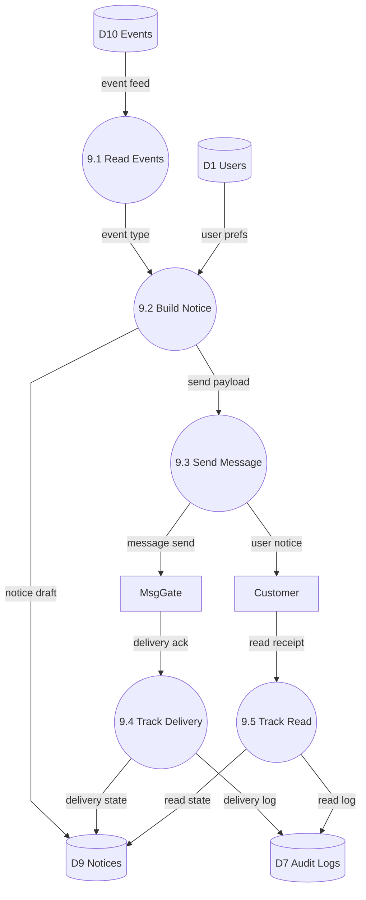

# Balancing Notes (Level 1 to Child Diagrams)

The child diagrams below are balanced to Level 1 by preserving external inputs/outputs and data store interactions of each parent process.

## Parent 1.0 Account Security -> Child 1.1 to 1.5

| Level 1 Interface | Child Coverage |
|---|---|
| Customer -> 1.0 (`login creds`) | `1.1 Check Login` receives customer credentials |
| Admin -> 1.0 (`admin creds`) | `1.1 Check Login` receives admin credentials |
| 1.0 -> D1 (`user profile`) | `1.1`, `1.3` update/read user records |
| 1.0 -> D6 (`auth token`) | `1.2`, `1.3`, `1.4` create/use tokens |
| 1.0 -> D7 (`auth log`) | `1.5 Record Security` writes security logs |
| 1.0 -> Customer (`session state`) | `1.4 Issue Session` returns customer session |
| 1.0 -> Admin (`admin session`) | `1.4 Issue Session` returns admin session |

## Parent 2.0 Quote Intake -> Child 2.1 to 2.5

| Level 1 Interface | Child Coverage |
|---|---|
| Customer -> 2.0 (`project scope`) | `2.1 Capture Scope` receives project details |
| 2.0 -> D2 (`quote draft`) | `2.3 Draft Quote` writes draft quote data |
| 2.0 -> D3 (`reserve hold`) | `2.4 Hold Reserve` creates reservation hold |
| 2.0 -> D10 (`quote event`) | `2.5 Record Intake` writes intake event record |

## Parent 3.0 Reserve Review -> Child 3.1 to 3.5

| Level 1 Interface | Child Coverage |
|---|---|
| Admin -> 3.0 (`schedule action`) | `3.1 Load Reserve` and `3.3 Set Schedule` consume schedule action |
| 3.0 -> D3 (`reserve update`) | `3.4 Update Reserve` writes reservation updates |
| 3.0 -> D10 (`reserve event`) | `3.5 Record Reserve` writes reservation events |

## Parent 4.0 Quote Decision -> Child 4.1 to 4.5

| Level 1 Interface | Child Coverage |
|---|---|
| Admin -> 4.0 (`quote action`) | `4.1 Load Quote` and `4.3 Set Decision` consume admin actions |
| 4.0 -> D2 (`quote update`) | `4.3 Set Decision` writes quote status updates |
| 4.0 -> 5.0 (`order create`) | `4.4 Convert Order` emits order creation trigger |
| 4.0 -> D10 (`decision event`) | `4.3` and `4.4` emit decision/conversion events |

## Parent 5.0 Order Tracking -> Child 5.1 to 5.5

| Level 1 Interface | Child Coverage |
|---|---|
| Admin -> 5.0 (`install update`) | `5.1 Load Order` and `5.3 Set Progress` consume installation updates |
| 5.0 -> D4 (`order update`) | `5.4 Update Order` writes order status changes |
| 5.0 -> D10 (`order event`) | `5.5 Record Order` writes order lifecycle events |
| 5.0 -> D7 (`order log`) | `5.5 Record Order` writes order audit logs |

## Parent 6.0 Payment Verify -> Child 6.1 to 6.6

| Level 1 Interface | Child Coverage |
|---|---|
| Customer -> 6.0 (`payment proof`) | `6.1 Receive Proof` ingests proof submission |
| Admin -> 6.0 (`payment action`) | `6.3 Check Gateway` includes manual review input |
| 6.0 -> D5 (`payment state`) | `6.4 Set Payment` writes payment state |
| 6.0 -> D2 (`quote status`) | `6.5 Sync Status` updates quote status |
| 6.0 -> D3 (`reserve lock`) | `6.5 Sync Status` updates reservation lock |
| 6.0 -> PayGate (`verify request`) | `6.3 Check Gateway` sends verification request |
| PayGate -> 6.0 (`verify status`) | `6.3 Check Gateway` receives verification result |
| 6.0 -> D10 (`payment event`) | `6.4` and `6.5` emit payment/status events |
| 6.0 -> D7 (`payment log`) | `6.6 Record Payment` writes audit logs |

## Parent 7.0 Admin Catalog -> Child 7.1 to 7.5

| Level 1 Interface | Child Coverage |
|---|---|
| Admin -> 7.0 (`catalog edits`) | `7.1 Load Catalog` and `7.2 Edit Service` process catalog updates |
| 7.0 -> D8 (`service data`) | `7.4 Apply Changes` writes service catalog data |
| 7.0 -> D1 (`user update`) | `7.3 Edit User` and `7.4 Apply Changes` write user changes |
| 7.0 -> D7 (`admin log`) | `7.5 Record Admin` writes admin activity logs |

## Parent 8.0 Analytics -> Child 8.1 to 8.5

| Level 1 Interface | Child Coverage |
|---|---|
| D2 -> 8.0 (`quote metrics`) | `8.1 Read Metrics` ingests quote metrics |
| D3 -> 8.0 (`reserve metrics`) | `8.1 Read Metrics` ingests reservation metrics |
| D4 -> 8.0 (`order metrics`) | `8.1 Read Metrics` ingests order metrics |
| D5 -> 8.0 (`payment metrics`) | `8.1 Read Metrics` ingests payment metrics |
| D10 -> 8.0 (`event metrics`) | `8.1 Read Metrics` ingests event metrics |
| D7 -> 8.0 (`system logs`) | `8.1 Read Metrics` ingests audit logs |
| 8.0 -> Admin (`dashboard stats`) | `8.5 Publish Stats` returns dashboard metrics |

## Parent 9.0 Notify Dispatch -> Child 9.1 to 9.5

| Level 1 Interface | Child Coverage |
|---|---|
| D10 -> 9.0 (`event feed`) | `9.1 Read Events` consumes event feed |
| 9.0 -> D9 (`notice log`) | `9.2`, `9.4`, `9.5` create/update notice records |
| 9.0 -> MsgGate (`send message`) | `9.3 Send Message` sends outbound payload |
| MsgGate -> 9.0 (`delivery ack`) | `9.4 Track Delivery` receives delivery status |
| 9.0 -> Customer (`user notice`) | `9.3` dispatches customer notifications |

## Reviewer Checkpoints

1. Every parent process input in Level 1 appears in its child diagram at least once.
2. Every parent process output in Level 1 is produced by at least one child process.
3. Child diagrams may add internal subprocess flows, but must not drop any Level 1 interface flow.

# Legend

| Element | Label | Description |
|---|---|---|
| External Entity | Customer | End user who requests quotes, holds reservations, pays, and receives notices. |
| External Entity | Admin | Internal operator who reviews quotes, schedules work, and manages catalog. |
| External Entity | Pay Gateway | Third-party payment verifier used to confirm payments. |
| External Entity | Msg Gateway | External messaging service used to send notifications and receive delivery acknowledgments. |
| Process (Context) | Ermel Core System | The complete reservation, quotation, payment and order platform. |
| Process (Level 1) | Account Security | Authenticates users, issues sessions, and records security events. |
| Process (Level 1) | Quote Intake | Captures project scope and creates quote and reserve drafts. |
| Process (Level 1) | Reserve Review | Reviews and schedules reservation holds and updates. |
| Process (Level 1) | Quote Decision | Applies decisions to quotes and triggers order creation. |
| Process (Level 1) | Order Tracking | Tracks order progress, installations, and logs changes. |
| Process (Level 1) | Payment Verify | Validates payment proofs and synchronizes related state. |
| Process (Level 1) | Admin Catalog | Manages service catalog and controlled user edits. |
| Process (Level 1) | Analytics | Aggregates metrics and builds admin dashboards. |
| Process (Level 1) | Notify Dispatch | Builds notices, sends messages, and tracks delivery/read. |
| Process (Level 2) | 2.1 Capture Scope | Ingests customer project details for quoting. |
| Process (Level 2) | 2.2 Check Service | Validates requested services against catalog. |
| Process (Level 2) | 2.3 Draft Quote | Creates a quote draft and saves it to the quote store. |
| Process (Level 2) | 2.4 Hold Reserve | Places a provisional reservation for the project. |
| Process (Level 2) | 2.5 Record Intake | Emits intake events for downstream processing. |
| Process (Level 2) | 3.1 Load Reserve | Loads reservation context for review. |
| Process (Level 2) | 3.2 Check Slot | Checks availability for requested schedule. |
| Process (Level 2) | 3.3 Set Schedule | Sets appointment or installation times. |
| Process (Level 2) | 3.4 Update Reserve | Writes reservation status changes. |
| Process (Level 2) | 3.5 Record Reserve | Emits reservation events for audit and notifications. |
| Process (Level 2) | 4.1 Load Quote | Loads quote details for decisioning. |
| Process (Level 2) | 4.2 Check Scope | Evaluates quote scope against constraints. |
| Process (Level 2) | 4.3 Set Decision | Applies admin decision to the quote. |
| Process (Level 2) | 4.4 Convert Order | Converts approved quote into an order draft. |
| Process (Level 2) | 4.5 Record Decision | Logs decision for audit. |
| Process (Level 2) | 5.1 Load Order | Loads order details for tracking and updates. |
| Process (Level 2) | 5.2 Plan Install | Produces installation plans and resources. |
| Process (Level 2) | 5.3 Set Progress | Records progress updates for an order. |
| Process (Level 2) | 5.4 Update Order | Persists order status and detail changes. |
| Process (Level 2) | 5.5 Record Order | Emits order lifecycle events and logs. |
| Process (Level 2) | 6.1 Receive Proof | Receives payment proof submissions. |
| Process (Level 2) | 6.2 Validate Proof | Validates proof data and format. |
| Process (Level 2) | 6.3 Check Gateway | Sends verification to Pay Gateway and handles results. |
| Process (Level 2) | 6.4 Set Payment | Records payment verification state. |
| Process (Level 2) | 6.5 Sync Status | Updates quote and reserve status after payment. |
| Process (Level 2) | 6.6 Record Payment | Writes payment audit rows. |
| Process (Level 2) | 7.1 Load Catalog | Loads service catalog for editing. |
| Process (Level 2) | 7.2 Edit Service | Authorizes and stages service changes. |
| Process (Level 2) | 7.3 Edit User | Edits user records under admin control. |
| Process (Level 2) | 7.4 Apply Changes | Persists catalog and user changes. |
| Process (Level 2) | 7.5 Record Admin | Logs admin activities and changes. |
| Process (Level 2) | 8.1 Read Metrics | Reads metrics from stores for analysis. |
| Process (Level 2) | 8.2 Aggregate Data | Groups raw metrics into datasets. |
| Process (Level 2) | 8.3 Compute Trends | Computes trends and time series summaries. |
| Process (Level 2) | 8.4 Build Dashboard | Formats trend data for dashboard display. |
| Process (Level 2) | 8.5 Publish Stats | Returns dashboard metrics to admin. |
| Process (Level 2) | 9.1 Read Events | Reads system events for notification processing. |
| Process (Level 2) | 9.2 Build Notice | Builds notification payloads from events and prefs. |
| Process (Level 2) | 9.3 Send Message | Sends payloads to the messaging gateway. |
| Process (Level 2) | 9.4 Track Delivery | Tracks delivery acknowledgments and updates state. |
| Process (Level 2) | 9.5 Track Read | Records user read receipts. |
| Data Store | User Store (D1) | Persistent user profiles, roles and preferences. |
| Data Store | Quote Store (D2) | Quote drafts, revisions and final statuses. |
| Data Store | Reserve Store (D3) | Reservation holds, schedules and history. |
| Data Store | Order Store (D4) | Confirmed orders and installation records. |
| Data Store | Payment Store (D5) | Payment proofs, verification state and history. |
| Data Store | Token Store (D6) | Authentication and reset tokens. |
| Data Store | Audit Store (D7) | Audit trail for security, payments and admin actions. |
| Data Store | Service Store (D8) | Master catalog of glass and aluminum services. |
| Data Store | Notice Store (D9) | Notification drafts, send states and receipts. |
| Data Store | Event Store (D10) | System event feed used for notifications and analytics. |
