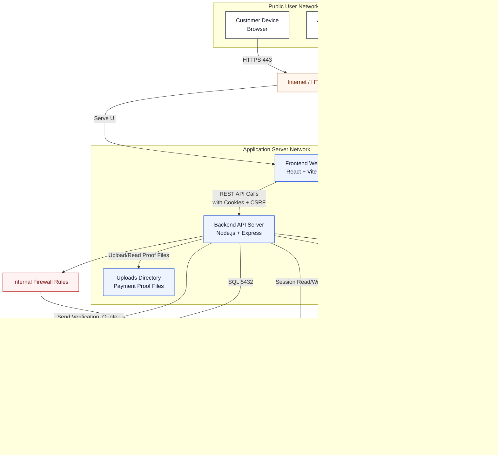

# Network Architecture (Ermel)

```mermaid
flowchart TB
  %% ===== User Zone =====
  subgraph Z1[Public User Network]
    U1[Customer Device\nBrowser]
    U2[Admin Device\nBrowser]
  end

  %% ===== Edge / Access =====
  NET[Internet / HTTPS]

  %% ===== Application Zone =====
  subgraph Z2[Application Server Network]
    FE[Frontend Web App\nReact + Vite Build]
    API[Backend API Server\nNode.js + Express]
    UP[Uploads Directory\nPayment Proof Files]
  end

  %% ===== Data Zone =====
  subgraph Z3[Private Data Network]
    DB[(PostgreSQL Database)]
    SES[(Session Store Table)]
  end

  %% ===== External Services =====
  subgraph Z4[External Service Network]
    SMTP[SMTP / Gmail Server]
    RT[Supabase Realtime]
    PDF[PDF Generation Service]
  end

  U1 -->|HTTPS 443| NET
  U2 -->|HTTPS 443| NET

  NET -->|Serve UI| FE
  FE -->|REST API Calls\nwith Cookies + CSRF| API

  API -->|SQL 5432| DB
  API -->|Session Read/Write| SES
  API -->|Upload/Read Proof Files| UP

  API -->|Send Verification, Quote, Payment Emails| SMTP
  DB -->|Change Events| RT
  RT -->|Realtime Updates| FE

  API -->|Generate Quote PDF| PDF
  API -->|Generate Cash Receipt PDF| PDF

  %% Suggested segmentation notes
  FW1[Firewall / WAF Rules]
  FW2[Internal Firewall Rules]

  NET --> FW1 --> FE
  API --> FW2 --> DB

  classDef user fill:#ffffff,stroke:#1f2937,stroke-width:1.2px,color:#111827;
  classDef edge fill:#fff7ed,stroke:#9a3412,stroke-width:1.2px,color:#7c2d12;
  classDef app fill:#eef4ff,stroke:#1d4ed8,stroke-width:1.2px,color:#0f172a;
  classDef data fill:#ecfeff,stroke:#155e75,stroke-width:1.2px,color:#083344;
  classDef ext fill:#f0fdf4,stroke:#166534,stroke-width:1.2px,color:#14532d;
  classDef sec fill:#fef2f2,stroke:#b91c1c,stroke-width:1.2px,color:#7f1d1d;

  class U1,U2 user;
  class NET edge;
  class FE,API,UP app;
  class DB,SES data;
  class SMTP,RT,PDF ext;
  class FW1,FW2 sec;
```
